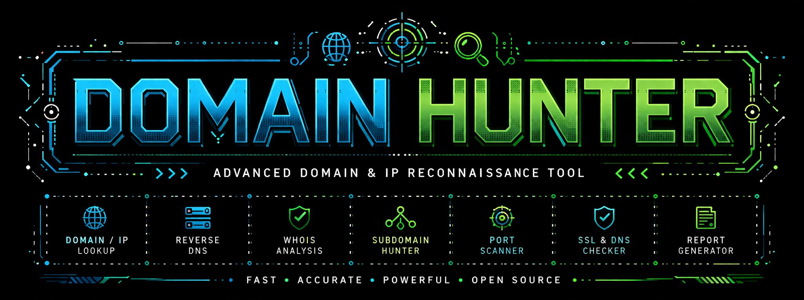
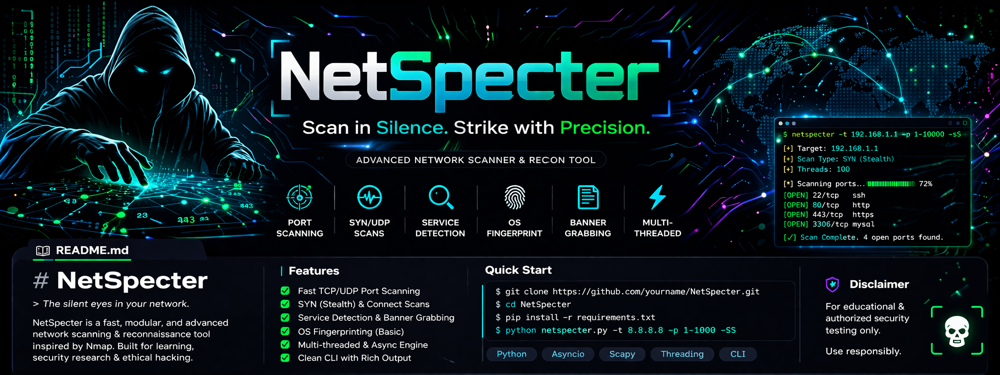
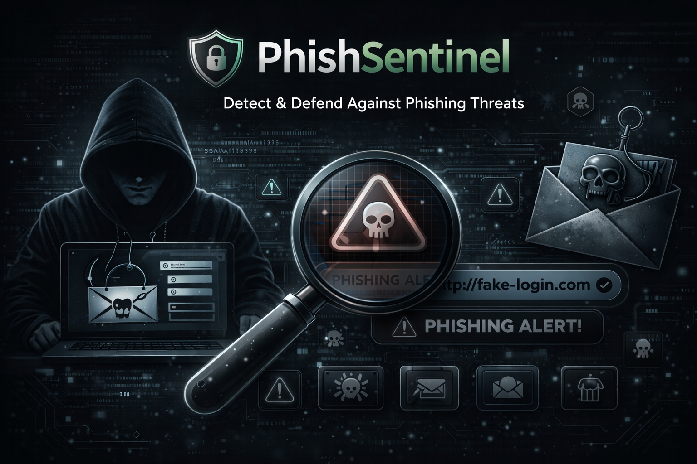

<body style="background-color:black">

# 💫 About Me

🔐 Aspiring SOC Analyst (L1)  
🐍 Python & 🖥️ Bash Scripting  
🛡️ Cybersecurity   
📊 Log Analysis & SIEM (Learning Phase)  
🚀 Building real-world security projects  

🎯 Goal: Become a skilled SOC Analyst & Cybersecurity Expert  

---

## 💻 Tech Stack

---

## 🛠️ Tools & Technologies
### 🚀 Working With

Passionate about cybersecurity and actively building hands-on experience with industry-standard tools. Currently exploring advanced concepts in penetration testing and SOC operations.

---

## 📊 Top GitHub Projects

### 🔐 Domain Hunter - Recon Toolkit

  

---

### 👻 NetSpecter  

--- 

### 🛡️ PhishSentinel (Under Development)

  

🚧 <b>Currently Under Development</b> 🚧

A smart phishing detection tool designed to analyze URLs, emails, and websites for phishing indicators.
It evaluates domain credibility, detects suspicious patterns, and generates risk scores to help users
identify potential cyber threats and malicious attacks.

---

## 📊 GitHub Analytics

  
  

  

  

  

</body>

<!-- 🔥 Profile crafted for Cybersecurity Journey -->

